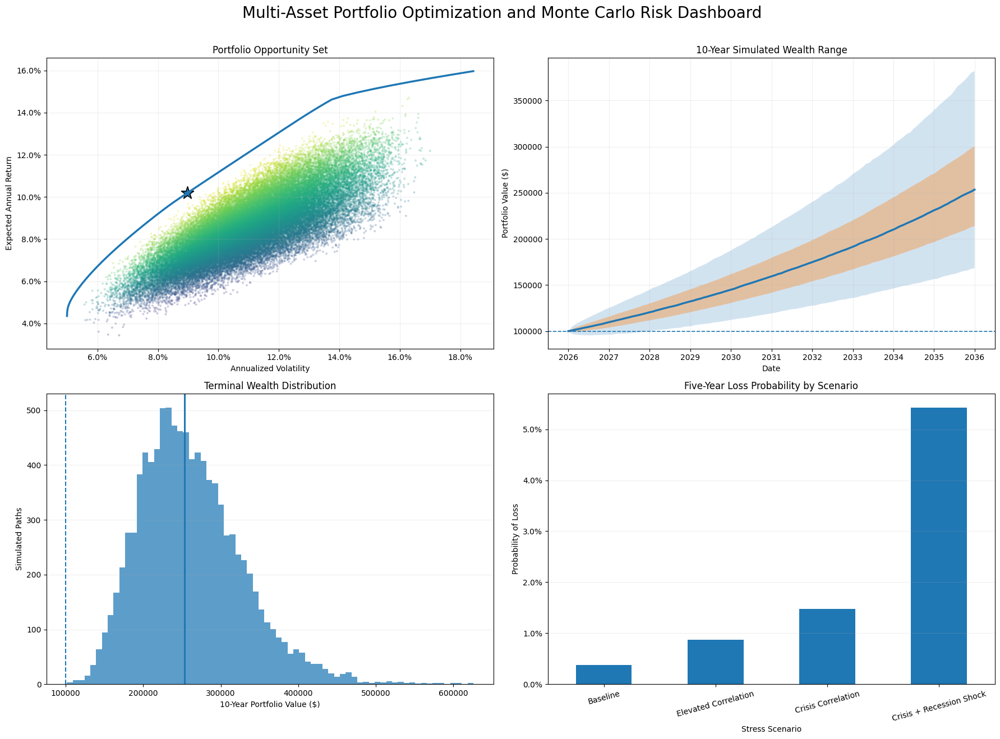
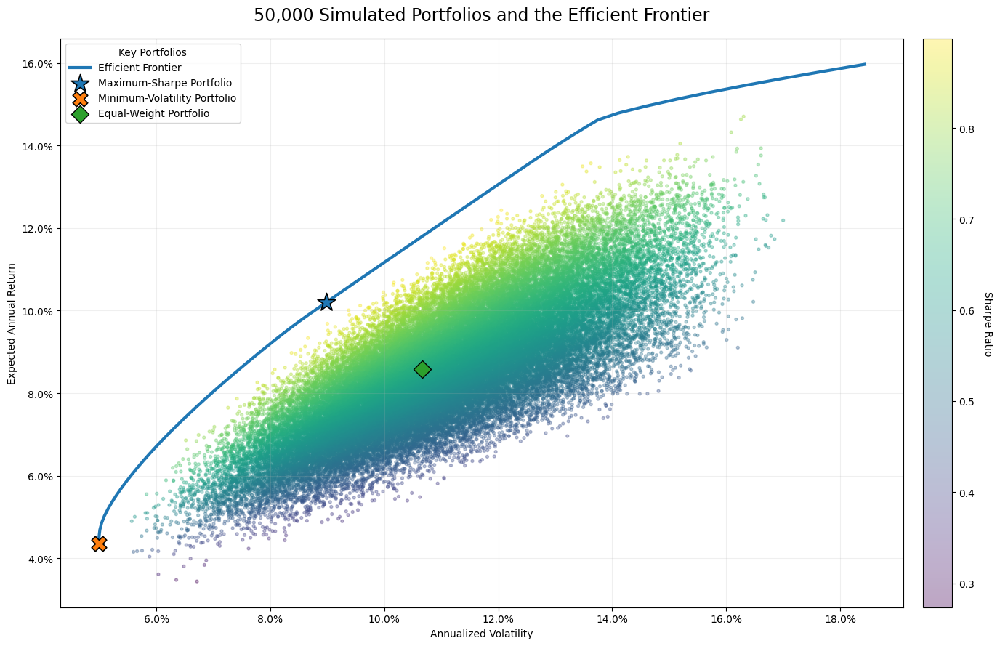
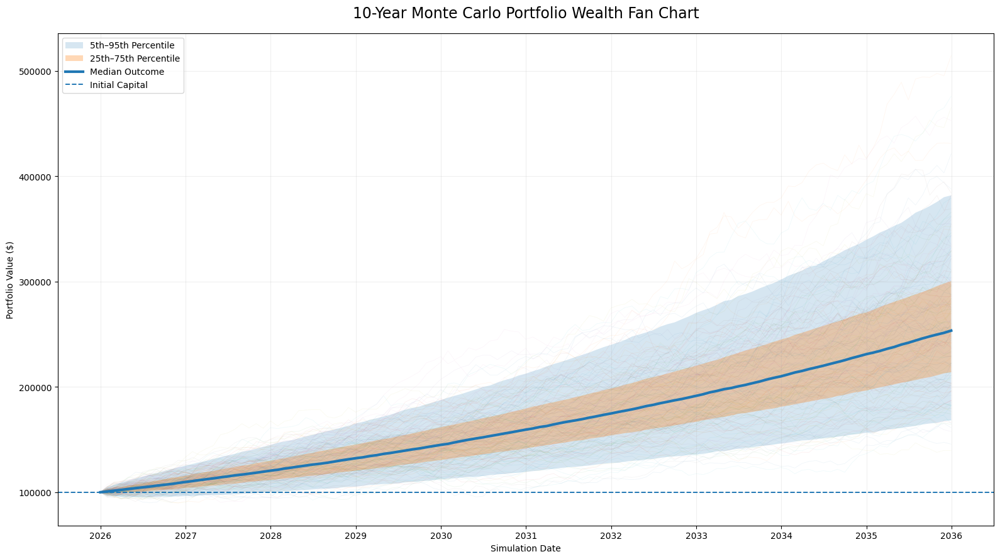
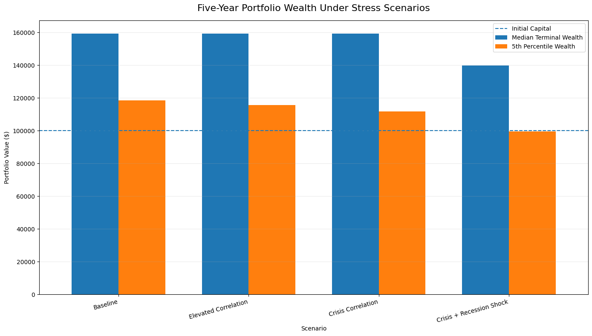
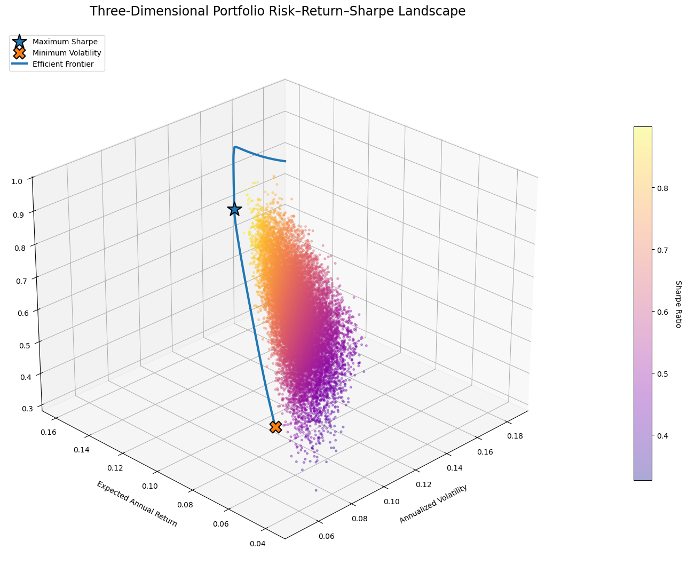
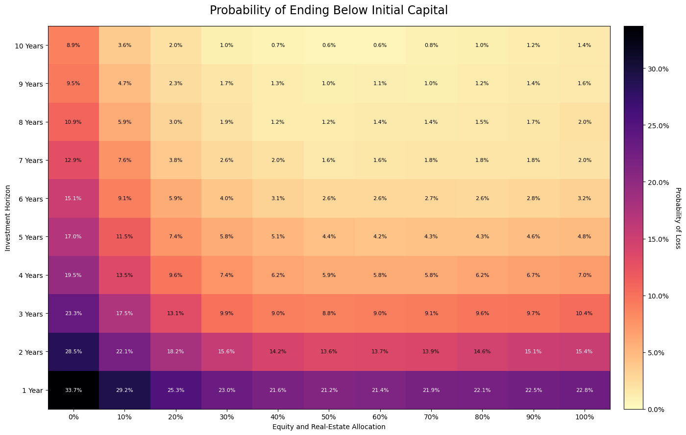
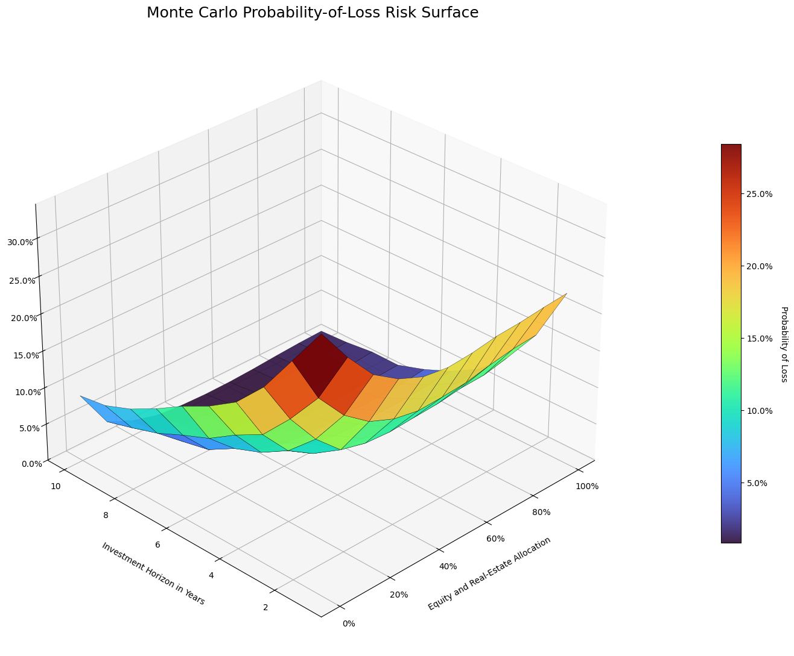

# Multi-Asset Monte Carlo Portfolio Optimizer and Risk Surface Lab

A reproducible quantitative-finance research notebook that combines
**constrained portfolio optimization**, **correlated Monte Carlo simulation**,
**historical block bootstrapping**, **stress testing**, and **two- and
three-dimensional risk visualization**.

The project analyzes ten liquid ETFs representing U.S. and international
equities, bonds, gold, real estate, and Treasury bills.



## Core research questions

- Which long-only allocation offers the strongest historical return-to-risk
  tradeoff under a 35% per-asset cap?
- How does the optimized portfolio behave across thousands of simulated
  10-year futures?
- How sensitive are conclusions to parametric assumptions versus resampled
  historical returns?
- How do rising correlations and weaker risky-asset returns affect downside
  risk?
- How do investment horizon and equity allocation change the probability of
  finishing below initial capital?

## Asset universe

| ETF | Exposure |
|---|---|
| SPY | U.S. large-cap equities |
| QQQ | Nasdaq-100 equities |
| IWM | U.S. small-cap equities |
| EFA | Developed international equities |
| EEM | Emerging-market equities |
| TLT | Long-term U.S. Treasuries |
| LQD | Investment-grade corporate bonds |
| GLD | Gold |
| VNQ | U.S. real estate |
| BIL | Short-term Treasury bills |

## Analytical pipeline

1. Download and validate adjusted ETF prices.
2. Retrieve a time-varying three-month Treasury yield from FRED.
3. Estimate annualized returns, volatility, covariance, and correlation.
4. Simulate 50,000 bounded random portfolios.
5. Optimize maximum-Sharpe and minimum-volatility portfolios with SLSQP.
6. Construct a 70-point efficient frontier.
7. Simulate 10,000 correlated monthly portfolio paths for 10 years.
8. Model monthly weight drift, rebalancing, and 5-basis-point trading costs.
9. Compare a Gaussian parametric model with a six-month historical block
   bootstrap.
10. Stress correlations and risky-asset expected returns.
11. Build allocation-by-horizon loss-probability heatmaps and a 3D risk
    surface.

## Optimization results

| Portfolio | Expected return | Volatility | Sharpe ratio |
|---|---:|---:|---:|
| Maximum Sharpe | 10.20% | 8.98% | 0.957 |
| Minimum Volatility | 4.36% | 4.99% | 0.551 |
| Equal Weight | 8.58% | 10.66% | 0.654 |

### Maximum-Sharpe allocation

| ETF | Weight |
|---|---:|
| QQQ | 35.00% |
| BIL | 32.55% |
| GLD | 21.90% |
| SPY | 6.30% |
| TLT | 4.24% |

The optimizer reaches the 35% cap in QQQ and assigns large weights to BIL and
GLD. This is a historical corner solution, not a universal recommendation.
Mean-variance portfolios are highly sensitive to expected-return estimates,
sample periods, constraints, and the chosen asset universe.



## Ten-year Monte Carlo results

The main parametric model generated **10,000 paths** over 120 monthly periods.

| Measure | Simulated result |
|---|---:|
| Median terminal wealth | $253,415 |
| 5th-percentile terminal wealth | $168,226 |
| 95th-percentile terminal wealth | $381,819 |
| Median simulated CAGR | 9.74% |
| Median maximum drawdown | -9.43% |
| Paths ending below $100,000 | 0.00% |

The reported 0.00% 10-year loss rate means that none of the 10,000 paths ended
below the starting value under this model and its historical assumptions. It
does **not** mean that a real-world loss is impossible.



## Parametric versus block-bootstrap simulation

| Model | Median wealth | 5th percentile | Median drawdown |
|---|---:|---:|---:|
| Parametric Monte Carlo | $253,415 | $168,226 | -9.43% |
| Historical Block Bootstrap | $254,586 | $168,913 | -10.42% |

The bootstrap produced a somewhat worse lower-tail drawdown, illustrating why
model choice matters.

## Stress-test results

The project also runs four five-year scenarios:

| Scenario | Median wealth | 5th percentile | Loss probability | Median drawdown |
|---|---:|---:|---:|---:|
| Baseline | $159,332 | $118,605 | 0.38% | -7.60% |
| Elevated correlation | $159,216 | $115,635 | 0.88% | -8.85% |
| Crisis correlation | $159,256 | $111,782 | 1.47% | -9.99% |
| Crisis + recession shock | $139,859 | $99,504 | 5.42% | -11.79% |



## Advanced risk visualizations

### Three-dimensional portfolio opportunity set



### Probability-of-loss heatmap



### Three-dimensional allocation and horizon risk surface



## Repository structure

```text
monte_carlo_portfolio_optimizer/
├── notebooks/
│   └── monte_carlo_portfolio_optimizer.ipynb
├── images/
│   ├── allocation_comparison.png
│   ├── correlation_heatmap.png
│   ├── efficient_frontier.png
│   ├── executive_risk_dashboard.png
│   ├── loss_probability_by_horizon.png
│   ├── loss_probability_heatmap.png
│   ├── maximum_drawdown_distribution.png
│   ├── monte_carlo_fan_chart.png
│   ├── normalized_asset_growth.png
│   ├── parametric_vs_bootstrap.png
│   ├── stress_test_wealth.png
│   ├── terminal_wealth_distribution.png
│   ├── three_dimensional_portfolio_cloud.png
│   └── three_dimensional_risk_surface.png
├── outputs/
│   ├── allocation_horizon_loss_probability.csv
│   ├── efficient_frontier.csv
│   ├── final_project_summary.csv
│   ├── horizon_risk_summary.csv
│   ├── optimized_portfolio_summary.csv
│   ├── optimized_portfolio_weights.csv
│   ├── simulation_model_comparison.csv
│   └── stress_test_summary.csv
├── docs/
│   ├── LIMITATIONS.md
│   ├── METHODOLOGY.md
│   └── REPRODUCIBILITY.md
├── .gitignore
├── CITATIONS.md
├── LICENSE
├── README.md
└── requirements.txt
```

## Run in Google Colab

1. Open `notebooks/monte_carlo_portfolio_optimizer.ipynb`.
2. Select **Runtime → Restart session and run all**.
3. Wait for Cell 31 to print `PROJECT COMPLETED SUCCESSFULLY`.
4. Cell 32 downloads the exported CSV archive.

The uploaded repository notebook was verified to execute sequentially from
Cell 1 through Cell 32 without stored errors.

## Run locally

```bash
python -m venv .venv
source .venv/bin/activate
pip install -r requirements.txt
jupyter notebook
```

Windows PowerShell:

```powershell
python -m venv .venv
.venv\Scripts\Activate.ps1
pip install -r requirements.txt
jupyter notebook
```

The final browser-download cell is specific to Google Colab and can be skipped
when running locally.

## Important limitations

- Historical average returns are noisy and unstable.
- Mean-variance optimization can produce concentrated corner solutions.
- The parametric simulation assumes monthly log returns follow a multivariate
  normal process with stable parameters.
- The bootstrap can only reproduce patterns present in the historical sample.
- The fixed ETF universe and analysis period were selected with present-day
  knowledge.
- Correlations, expected returns, and volatility may change abruptly.
- The model uses a simple fixed transaction-cost assumption.
- Taxes, bid-ask spreads, market impact, fund closures, and tracking differences
  are not fully modeled.
- Stress scenarios are illustrative rather than forecasts.
- The project does not use a fully held-out out-of-sample evaluation.

## Disclaimer

This repository is for educational research only. It is not investment advice,
and simulated or historical performance does not guarantee future results.
